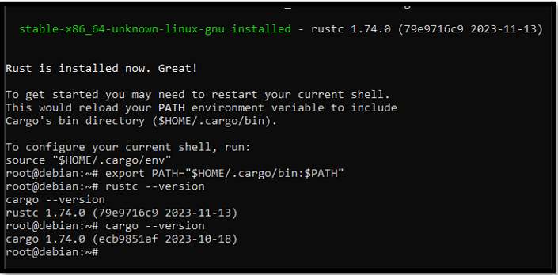

# Installation d'OpenWEC

## 1. Préparation

Avant tout téléchargement il faut qu'il y est les packages Rust et Cargo sur la machine.

```bash
openwec@openwec:~# sudo curl --proto '=https' --tlsv1.2 -sSf https://sh.rustup.rs | sh
openwec@openwec:~# rustc --version
openwec@openwec:~# cargo --version
```



## 2. Téléchargement d'OpenWEC

```bash
openwec@openwec:~# sudo git clone https://github.com/cea-sec/openwec.git
openwec@openwec:~# cd openwec
openwec@openwec:~# sudo apt install libclang-dev libkrb5-dev libgssapi-krb5-2 libsqlite3-dev msktutil
openwec@openwec:~# cargo build --release
```

Après avoir fini l’installation je copie les fichiers openwec et openwecd dans /usr/local/bin :

```bash
openwec@openwec:~#  sudo cp .target/release/openwecd /usr/local/bin
openwec@openwec:~#  sudo cp .target/release/openwec /usr/local/bin
```

Puis je crée un service systemd pour openwec avec la commande suivante :

```bash
openwec@openwec:~# sudo systemctl edit openwec.service --full --force
```

```bash
[Unit]
Description=Windows Events Collector
After=network.target
[Service]
Type=simple
User=openwec
Restart=always
RestartSec=5s
ExecStart=/usr/local/bin/openwecd -c /etc/openwec/openwec.conf.toml
[Install]
WantedBy=multi-user.target
```

Je crée ensuite un dossier pour la base de données et les logs tout en donnant les droits d’utilisateur openwec (si jamais l’utilisateur openwec n’est pas créé, il faut le crée avec la commande adduser « nom d’utilisateur »).

```bash
# Dossier pour la base de données
openwec@openwec:~# sudo mkdir /var/db/openwec
openwec@openwec:~# sudo chown -R openwec:openwec /var/db/openwec

# Dossier permettant de stocker les logs:
openwec@openwec:~# sudo mkdir /openwec
openwec@openwec:~# sudo chown -R openwec:openwec /openwec
```

## 2. Configuration du serveur OpenWEC

Pour la configuration du serveur, je crée un dossier dans le répertoire /etc puis je crée un fichier openwec.conf.toml

```bash
openwec@openwec:~# sudo mkdir /etc/openwec
```

``` bash
root@openwec:~# cat /etc/openwec/openwec.conf.toml 
[server]
db_sync_interval = 5
flush_heartbeats_interval = 5
keytab = "/etc/allwec.keytab"
[logging]
verbosity = "info"
[database]
type = "SQLite"
path = "/var/db/openwec/db.sqlite"
[[collectors]]
hostname = "openwec.sevenkingdoms.local"
listen_address = "0.0.0.0"
[collectors.authentication]
type = "Kerberos"
service_principal_name = "http/openwec.sevenkingdoms.local@SEVENKINGDOMS.LOCAL"
```

### Initialisation de la database

Création d’une base de données avec la commande suivante :

```bash
openwec@openwec:~# sudo openwec -c /etc/openwec.conf.toml db init
```

### Configuration de la subscription avec les règles de l'ANSSI

Je configure ensuite la subscription avec les règles de l’ANSSI, tout d’abord je récupère les règles avec un wget :

```bash
# Recupèration des règles de l'ANSSI
sudo wget -O anssi.xml https://raw.githubusercontent.com/ANSSI-FR/guide-journalisationmicrosoft/main/Standard_WEC_query.xml

# Création de la subscription
sudo openwec -c /etc/openwec/openwec.conf.toml subscriptions new anssisubscription ./Standard_WEC_query.xml

# Configuration de la sortie des logs
sudo openwec subscriptions edit anssi-subscription outputs add --format json files /openwec/log

# Activation la subscription
sudo openwec subscriptions enable anssi-subscription
```

Pour lister les différentes subscriptions il est possible d’utiliser la commande suivante :

```bash
openwec subscriptions
```

## 3. Configuration sur Windows

Je reprends la configuration de la GPO WEF déjà vue en cours [ici](https://github.com/pushou/pushou_public_pdf/blob/main/BUT/R5.cyber.11/installation_wef_policy_en_images.pdf) . Ensuite je configure le « target » Subscription Manager.

Pour cela sur ma machine GOAD-DC01, je vais sur le terminal Windows je tape la commande « gpedit.msc » qui va m’ouvrir la fenêtre du Group Policy Management disponible aussi sur Server Manager.

Je vais par la suite dans :

```bash
Computer Configuration > Policies > Administratives Templates > Windows Components > Event Forwarding > Configure Subcription Manager > Mettre en mode Enabled > Puis j’ajoute l’adresse du serveur (Server=http/<hostname de la machine serveur>:5985/test,Refresh=60)
```

Dans mon cas cela sera :

```bash
Server=http://openwec.sevenkingdoms.local:5985/test,Refresh=60
```

NOTE : le port choisi est 5985 car nous sommes en HTTP, si jamais il fallait configurer en HTTPS il faudrait donc utiliser le port 5986.


Toujours dans Computer Configuration --> Policies --> Administratives Templates --> Windows Components, il faut aller cette fois dans Event Log Service puis Security et enfin « Configure log access » et « Configure log access legacy ».

Mettre le champ en mode Enable puis entrer le SDDL de base de la machine suivi du SDDL de l’utilisateur EventLogReader qui est « (A ;;0x1 ;;;NS) »

NOTE : Pour avoir le SDDL de base de la machine il faut taper la commande suivante : wevtutil gl security

La valeur a ajouté est donc la suivante :

```bash
O:BAG:SYD:(A;;0xf0005;;;SY)(A;;0x5;;;BA)(A;;0x1;;;S-1-5-32-573)(A;;0x1;;;NS)
```

Je configure par la suite les règles de sécurité de l’ANSSI pour l’audit en suivant le PDF [ici](https://cyber.gouv.fr/sites/default/files/2022-09/anssi-guide-recommandations_securite_journalisation_systemes_microsoft_windows_environnement_active_directory.pdf).

Les règles à configuré sont dans :

```bash
Group Policy Management > Forest sevenkingdoms.local > Domains > sevenkingdoms.local > Group Policy Object > GPO WEF > Clique droit sur “Edit” > Computer configuration > Policies > Windows Settings > Security Settings > Advanced Audit Policy Configuration > Audit Policies
```

Audit de sécurité configuré sur le GOAD-DC01 :


Vérification que les règles d’audit sont bien configurées sur la GPO :


### Configuration du DNS et de l'utilisateur openwec

Il faut ensuite ajouter une entrée au DNS Windows de l’AD pour le serveur openwec dans :

```bash
DNS Management > Dérouler le menu du domaine windows “sevenkingdoms.local” > Forward Lookup Zones > “sevenkingdoms.local” > Clic droit sur la page > New host A or AAAA
```


J’ajoute aussi l’utilisateur openwec avec le user logon « http/openwec.sevenkingdoms.local » pour l’authentification Kerberos.

Pour la création de l’utilisateur je vais dans :

```bash
Server Manager > En haut à droite “Tools” > Active Directory Users and Computers > sevenkingdoms.local > Users > Clic droit > New User
```


IMPORTANT : La syntaxe est très importante pour Kerberos si on déclare le user logon tout en minuscule il faut qu’il le soit partout (que ce soit dans le fichier de configuration openwec.conf.toml ou dans la commande de génération du SPN et de la génération des keytab).

Je modifie le fichier /etc/hosts sur le serveur OpenWEC ( machine Ubuntu) pour ajouter les différentes machines du GOAD (DC01 – DC02 – DC03).

```bash
openwec@openwec:~# cat /etc/hosts
127.0.0.1 localhost
127.0.1.1 openwec
10.202.0.154 openwec
10.202.0.58 kingslanding.sevenkingdoms.local kingslanding
10.202.0.184 winterfell.north.sevenkingdoms.local winterfell
10.202.0.93 meereen.essos.local meereen

# The following lines are desirable for IPv6 capable hosts
::1     ip6-localhost ip6-loopback
fe00::0 ip6-localnet
ff00::0 ip6-mcastprefix
ff02::1 ip6-allnodes
ff02::2 ip6-allrouters
```

### Authentification Kerberos

Il faut maintenant configurer tout ce qui est en lien avec l’authentification Kerberos. Pour ce faire je vais commencer par relier le SPN à l’utilisateur openwec (Windows), l’exemple suivant est sur le domaine sevenkingdoms.local mais il faut le faire sur les 3 DC.

Je tape la commande suivante sur le cmd Windows en mode administrateur :

```powershell
PS C:\Windows\system32> setspn -S http://openwec.sevenkingdoms.local openwec
Checking domain DC=sevenkingdoms,DC=local

Registering ServicePrincipalNames for CN=openwec openwec,CN=Users,DC=sevenkingdoms,DC=local
        http/openwec.sevenkingdoms.local
Updated object
```

Je vérifie ensuite la bonne génération du SPN sur l’utilisateur openwec

```powershell
PS C:\Windows\system32> setspn -L openwec
Registered ServicePrincipalNames for CN=openwec,CN=Users,DC=sevenkingdoms,DC=local:
        http/openwec.sevenkingdoms.local
```

Il est aussi possible de vérifier si le SPN générer précdemment est bien existant avec la commande suivante :

```powershell
PS C:\Windows\system32> setspn -Q http/openwec.sevenkingdoms.local
```

Je génére par la suite un fichier keytab sur le DC avec la commande suivante :

```powershell
PS C:\Windows\system32> ktpass -princ http/openwec.sevenkingdoms.local@SEVENKINGDOMS.LOCAL -mapuser openwec -crypto ALL -mapop set -ptype KRB5_NT_PRINCIPAL -pass openwec -target kingslanding.sevenkingdoms.local -kvno 0 -out c:\Users\vagrant\Desktop\dc1.keytab
```

Résultat de la commande :

```powershell
Successfully mapped http/openwec.sevenkingdoms.local to openwec.
Password successfully set!
Key created.
Key created.
Key created.
Key created.
Key created.
Output keytab to c:\Users\vagrant\Desktop\dc1.keytab:
Keytab version: 0x502
keysize 79 http/openwec.sevenkingdoms.local@SEVENKINGDOMS.LOCAL ptype 1 (KRB5_NT_PRINCIPAL) vno 0 etype 0x1 (DES-CBC-CRC) keylength 8 (0x26d9ba32979e045d)
keysize 79 http/openwec.sevenkingdoms.local@SEVENKINGDOMS.LOCAL ptype 1 (KRB5_NT_PRINCIPAL) vno 0 etype 0x3 (DES-CBC-MD5) keylength 8 (0x26d9ba32979e045d)
keysize 87 http/openwec.sevenkingdoms.local@SEVENKINGDOMS.LOCAL ptype 1 (KRB5_NT_PRINCIPAL) vno 0 etype 0x17 (RC4-HMAC) keylength 16 (0xe254d115218ed6028cf9fec194730dff)
keysize 103 http/openwec.sevenkingdoms.local@SEVENKINGDOMS.LOCAL ptype 1 (KRB5_NT_PRINCIPAL) vno 0 etype 0x12 (AES256-SHA1) keylength 32 (0x0bcde2a8869ba640c2c6bd421b6908f9927d0e90633db6231a521adbad7e2162)
keysize 87 http/openwec.sevenkingdoms.local@SEVENKINGDOMS.LOCAL ptype 1 (KRB5_NT_PRINCIPAL) vno 0 etype 0x11 (AES128-SHA1) keylength 16 (0x0051d71ab7fb60f609404aab59d673de)
```

Je copie ensuite la keytab sur le serveur OpenWEC avec scp :

```powershell
PS C:\Windows\system32> scp C:\Users\vagrant\Desktop\dc1.keytab openwec@10.202.0.154:~
```

Après avoir exécuté toutes ces étapes depuis la "Configuration sur Windows" il faut réitérer cela sur les 2 autres DC (GOAD-DC02 et GOAD-DC03).

### Fusion des keytab sur le serveur

Dès que les 3 keytabs sont généré sur les 3 DC et récupéré sur le serveur il faut maintenant les fusionner en une seule et unique keytab que je vais nommer allwec.keytab (ne pas oublier de déclarer cette keytab sur le fichier de configuration openwec.conf.toml).

Avant tout chose il faut installer le paquet Kerberos pour avoir l’utilitaire ktutil :

```bash
sudo apt install krb5-user
```

Je lance l’utilitaire ktutil (lancer ktutil dans le dossier où les 3 keytabs se trouvent) :

```bash
openwec@openwec:~# sudo ktutil
# Je lis les 3 keytabs
ktutil:  rkt dc1.keytab
ktutil:  rkt dc2.keytab
ktutil:  rkt dc3.keytab

# J'affiche le contenu avec la commande l
ktutil:  l
slot KVNO Principal
---- ---- ---------------------------------------------------------------------
   1    0 http/openwec.sevenkingdoms.local@SEVENKINGDOMS.LOCAL
   2    0 http/openwec.sevenkingdoms.local@SEVENKINGDOMS.LOCAL
   3    0 http/openwec.sevenkingdoms.local@SEVENKINGDOMS.LOCAL
   4    0 http/openwec.sevenkingdoms.local@SEVENKINGDOMS.LOCAL
   5    0 http/openwec.sevenkingdoms.local@SEVENKINGDOMS.LOCAL
   6    0 http/openwec.north.sevenkingdoms.local@NORTH.SEVENKINGDOMS.LOCAL
   7    0 http/openwec.north.sevenkingdoms.local@NORTH.SEVENKINGDOMS.LOCAL
   8    0 http/openwec.north.sevenkingdoms.local@NORTH.SEVENKINGDOMS.LOCAL
   9    0 http/openwec.north.sevenkingdoms.local@NORTH.SEVENKINGDOMS.LOCAL
  10    0 http/openwec.north.sevenkingdoms.local@NORTH.SEVENKINGDOMS.LOCAL
  11    0     http/openwec.essos.local@ESSOS.LOCAL
  12    0     http/openwec.essos.local@ESSOS.LOCAL
  13    0     http/openwec.essos.local@ESSOS.LOCAL
  14    0     http/openwec.essos.local@ESSOS.LOCAL
  15    0     http/openwec.essos.local@ESSOS.LOCAL
```

Je fusionne les 3 keytabs en créant une nouvelle avec la commande suivante :

```bash
ktutil:  wkt /etc/allwec.keytab

#Je sors de ktutil
ktutil: exit
```

Enfin, j’ajoute les droits utilisateur openwec sur la keytab que je viens de générer :

```bash
openwec@openwec:~# sudo chown -R openwec:openwec allwec.keytab
```

## 4. Démarrage du serveur

Je démarre le serveur avec la commande suivante :

```bash
openwec@openwec:~# systemctl start openwec.service
openwec@openwec:~# systemctl status openwec.service
● openwec.service - Windows Events Collector
    Loaded: loaded (/etc/systemd/system/openwec.service; enabled; preset: enabled)
    Active: active (running) since Fri 2023-12-08 07:38:40 UTC; 9s ago
   Main PID: 12982 (openwecd)
    Tasks: 7 (limit: 4563)
    Memory: 2.2M
        CPU: 6ms
    CGroup: /system.slice/openwec.service
            └─12982 /usr/local/bin/openwecd -c /etc/openwec/openwec.conf.toml

déc. 08 07:38:40 openwec systemd[1]: Started openwec.service - Windows Events Collector.
déc. 08 07:38:40 openwec openwecd[12982]: 2023-12-08T07:38:40.584431793+00:00 INFO server - Server settings: Server { db_sync_interval: Some(5), flush_heartbeats_interval: Some(5), heartbeats_queue_size: None, >
déc. 08 07:38:40 openwec openwecd[12982]: 2023-12-08T07:38:40.584530709+00:00 INFO server::subscription - reload_subscriptions task started
déc. 08 07:38:40 openwec openwecd[12982]: 2023-12-08T07:38:40.584575554+00:00 INFO server::heartbeat - Heartbeat task started
déc. 08 07:38:40 openwec openwecd[12982]: 2023-12-08T07:38:40.584806536+00:00 INFO server - Server listenning on 0.0.0.0:5985
déc. 08 07:38:40 openwec openwecd[12982]: 2023-12-08T07:38:40.585886476+00:00 INFO server::subscription - Subscription E6779B9E-A0CE-4FC4-AB51-31BDC58D7D86 has been created
déc. 08 07:38:40 openwec openwecd[12982]: 2023-12-08T07:38:40.585929079+00:00 INFO server::outputs::file - File output task started
```

Je peux vérifier les events avec la commande « openwec stats » :

```bash
openwec@openwec:~# openwec stats
Subscription anssi-subscription (CB04741B-9072-4E2D-B769-3570FA020BBD) - *
- 3 machines ever seen
- 3 active machines (event received since 2023-12-08T14:55:16+00:00)
- 0 alive machines (heartbeat received since 2023-12-08T14:55:16+00:00 but no events)
- 0 dead machines (no heartbeats nor events since 2023-12-08T14:55:16+00:00)
```

Je peut voir que les 3 machines DC01 / DC02 / DC03 sont actives et détecté par le serveur. Je peux aussi vérifier le dossier de log pour m’assurer que les logs remontent bien.

```bash
openwec@openwec:~# ls /openwec/log
10.202.0.184  10.202.0.58  10.202.0.93
```

Je peux voir que les logs remontent car le serveur reçoit bien les logs des 3 machines.

Enfin je peut voir le contenu des fichiers de log de l’une des machines avec la commande suivante :

```bash
root@openwec:~# tail -f /openwec/log/10.202.0.58/KINGSLANDING@SEVENKINGDOMS.LOCAL/messages | jq
```


On voit bien que les logs remontent bien dans notre serveur.
