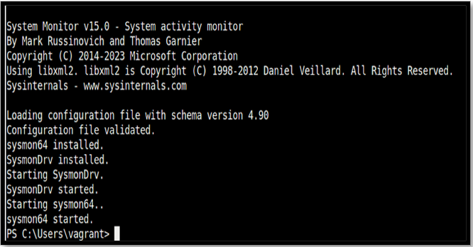
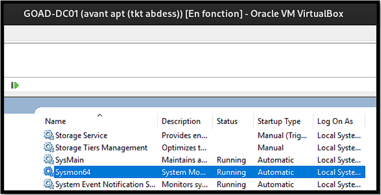
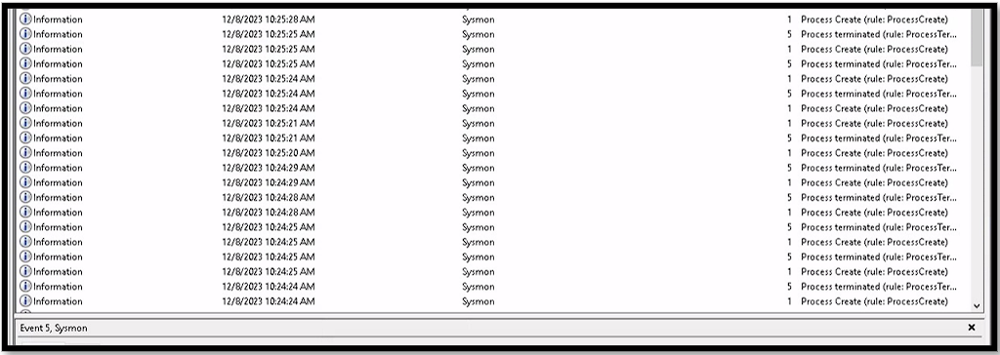

# Installation de Sysmon

L’installation de sysmon va permettre d’avoir des logs sur Windows plus poussés sur le processus et leurs utilisations.

Pour l’installation de sysmon il faut aller sur le cmd Windows et taper les commandes suivantes :

```powershell
PS C:\Users\vagrant> Invoke-WebRequest -Uri "https://download.sysinternals.com/files/Sysmon.zip" -OutFile "c:\users\vagrant\Desktop\Sysmon.zip"

PS C:\Users\vagrant> Invoke-WebRequest -Uri "https://raw.githubusercontent.com/Neo23x0/sysmon-config/master/sysmonconfig-export-block.xml" -OutFile "c:\users\vagrant\Desktop\sysmonconfig-export-block.xml"

PS C:\Users\vagrant> Expand-Archive -F c:\users\vagrant\desktop\Sysmon.zip -DestinationPath c:\users\vagrant\desktop\sysmon

PS C:\Users\vagrant> c:\users\vagrant\desktop\sysmon\sysmon64.exe -accepteula -i c:\users\vagrant\desktop\sysmonconfig-export-block.xml
```



On peut voir dans l’image ci-dessous que le service est bien installé en allant dans « Services » sur la barre de recherche Windows.



Je peux voir sur les évènements Windows que les logs sysmon apparaissent.


